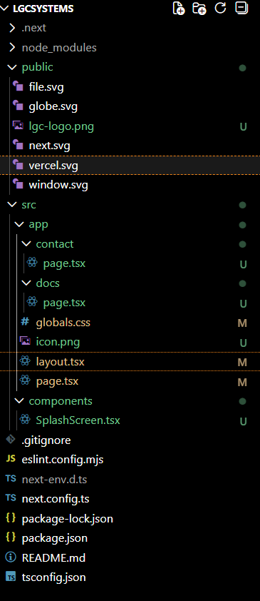
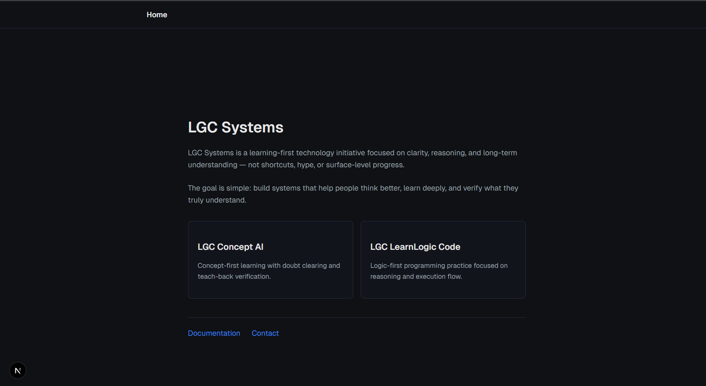
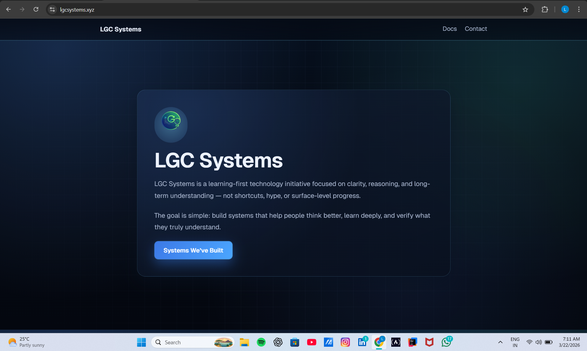
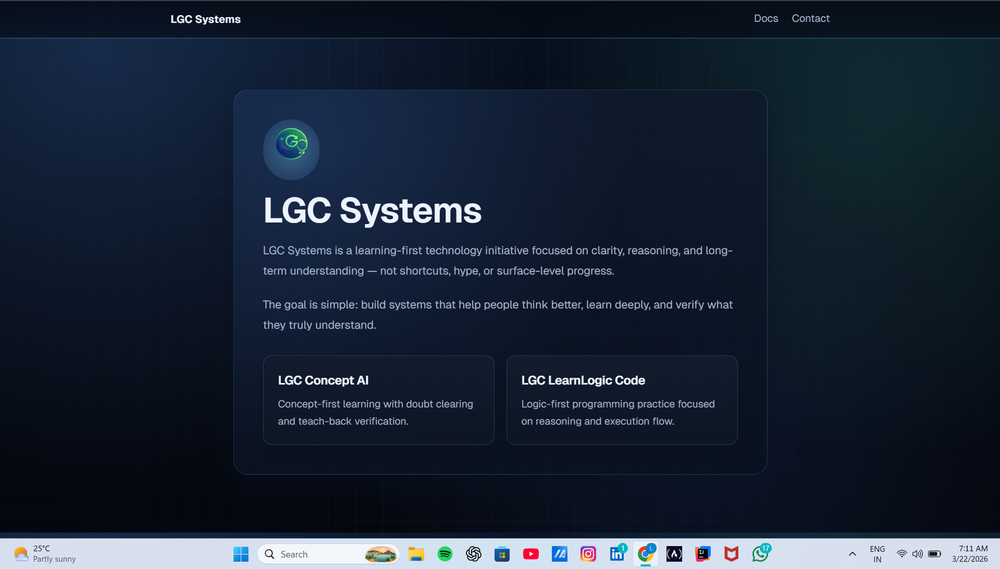
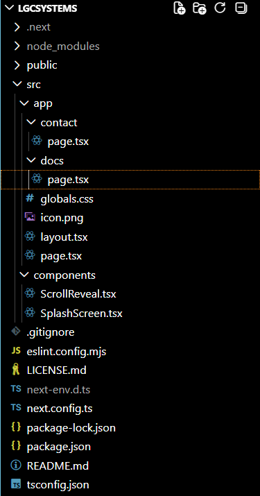
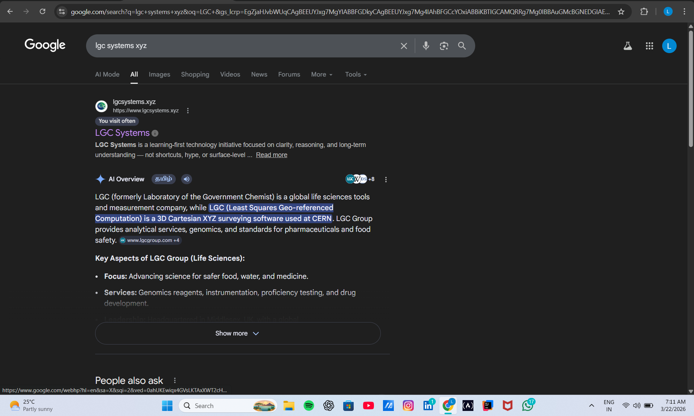
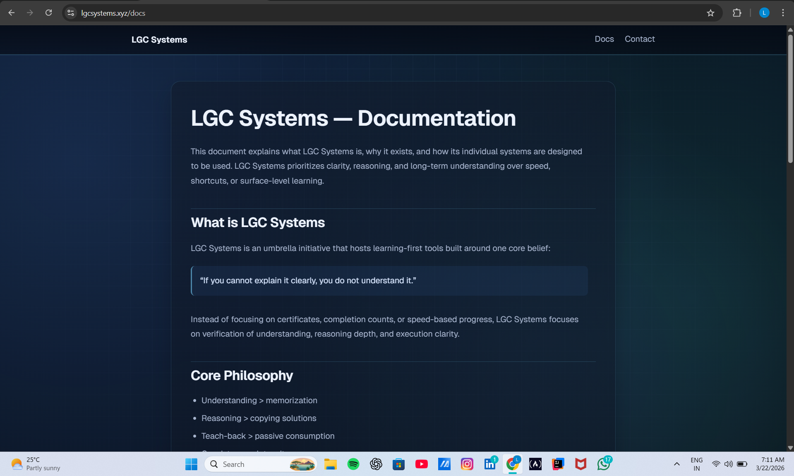
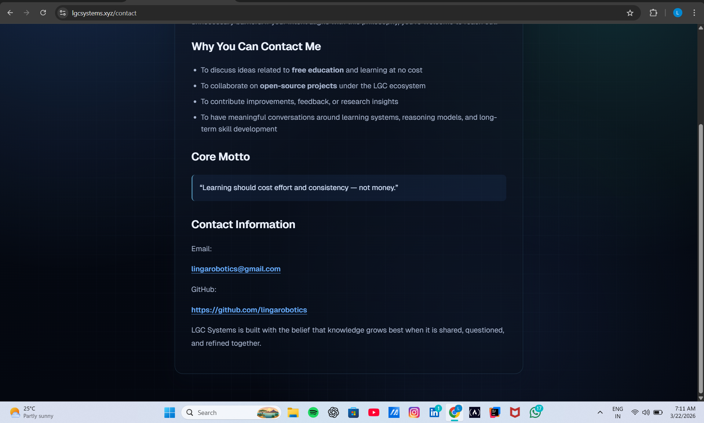

# 🌐 LGC Systems — Development Documentation

This documentation captures the **development journey of LGC Systems**,  
the umbrella platform integrating all LGC learning systems.

It focuses on:
> **platform evolution, system integration, and structural development**

---

## 🧬 What This Documentation Captures

This is not a feature-level breakdown.

It documents:
- how the umbrella system was formed  
- UI evolution of the platform  
- integration between products  
- structural organization  

Each screenshot represents a **stage in building the ecosystem**, not just UI.

---

## 🧠 Purpose

- Track platform development  
- Document system integration  
- Capture UI and structure evolution  
- Provide visual proof of ecosystem growth  

---

## 📂 Phase 1 — Early Foundation

### 🔹 Initial Folder Structure

- Basic project setup  
- Initial structuring of platform files  
- No strong system integration yet  

---

### 🔹 Early UI

- Initial visual representation  
- Minimal structure and navigation  
- Early-stage experimentation  

---

## 🔄 Phase 2 — Platform Formation

### 🔹 Home UI (Umbrella System)

- Central entry point for all LGC systems  
- Clear positioning of platform identity  
- Structured navigation introduced  

---

### 🔹 Product Linking System

- Integration of:
  - LGC Concept AI  
  - LearnLogic CODE  

- Platform acts as:
  > **connector between systems**

---

## 🧱 Phase 3 — Structure & Organization

### 🔹 Updated Folder Structure (v2)

- Improved organization  
- Better separation of concerns  
- Prepared for scaling  

---

## 🌐 Phase 4 — Platform Visibility & Identity

### 🔹 Search Engine Presence

- Platform indexed and visible publicly  
- Establishes system as a real product  

---

## 🧩 Phase 5 — Supporting Interfaces

### 🔹 Documentation UI

- Platform-level documentation access  
- Improves usability and clarity  

---

### 🔹 Contact Interface

- Communication entry point  
- Adds system completeness  

---

## 🔍 Key Learnings

- Platform clarity is essential for multi-system integration  
- Linking systems is as important as building them  
- Structure must evolve with system complexity  
- Visibility (search presence) validates system existence  

---

## 🧭 How to Use This Documentation

- Follow phases to understand platform evolution  
- Use structure references before scaling  
- Refer integration sections to understand system connections  
- Treat this as ecosystem-level development history  

---

## 👤 Author

**Ramalingam Jayavelu**  
LGC Systems